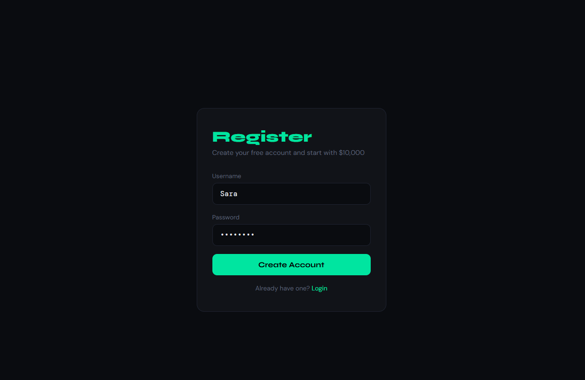
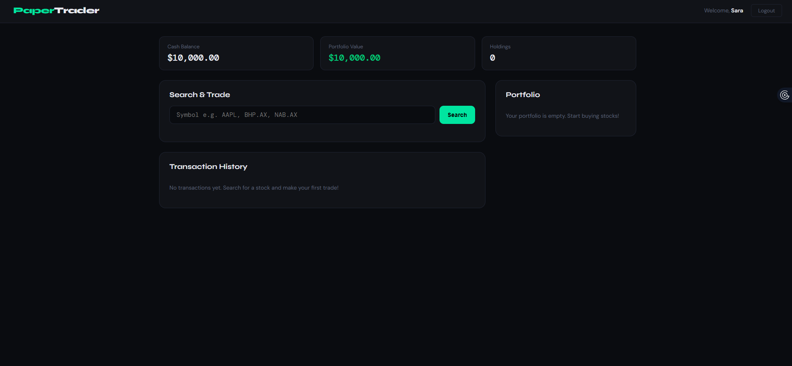
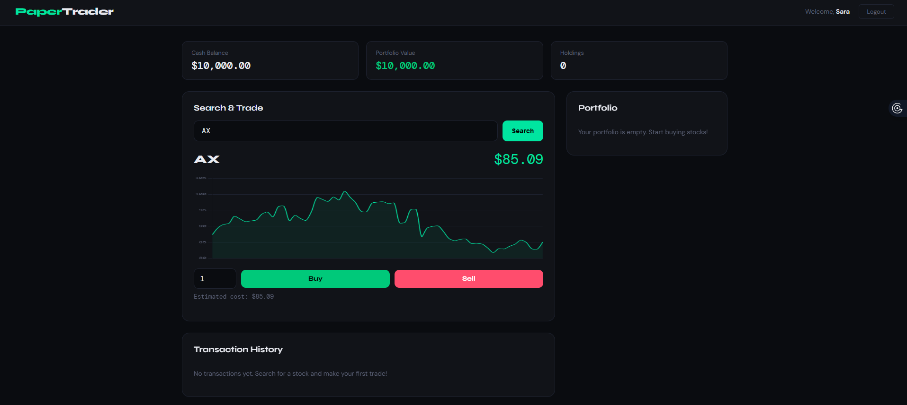
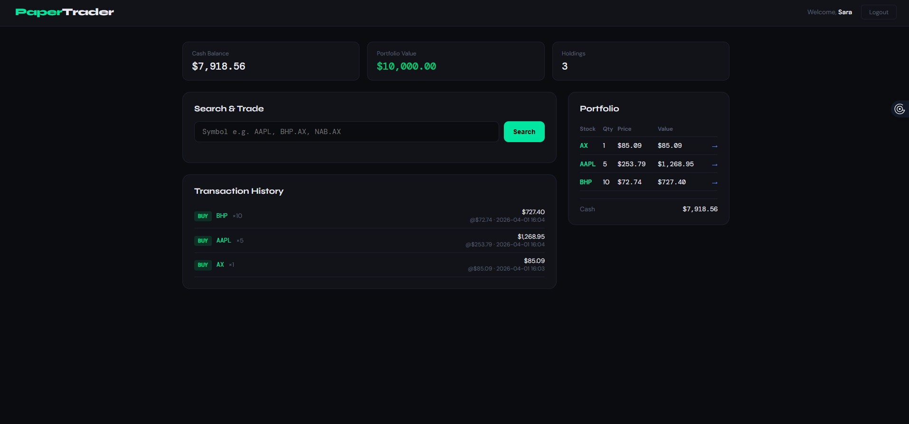

# Paper Trader — Full Setup Guide

A Python/Flask stock paper-trading web application.  
Start with **$10,000 virtual cash**, search real stocks, view live price charts, and buy/sell to build your portfolio.

---

## Project Structure

```
paper_trader/
├── app.py                  ← Flask backend (routes, trade logic, yfinance)
├── requirements.txt        ← Python dependencies
├── portfolio_data.json     ← Auto-created on first run (stores users & trades)
└── templates/
    ├── base.html           ← Shared layout (nav, fonts, CSS variables)
    ├── login.html          ← Login page
    ├── register.html       ← Registration page
    └── dashboard.html      ← Main app: search, chart, portfolio, transactions
```

---

## Screenshots

### Login Page


### Dashboard


### Chart


### Portfolio


## Step-by-Step Setup

### Step 1 — Install Python 3

Make sure Python 3.9+ is installed:
```bash
python3 --version
```
Download from https://www.python.org if needed.

---

### Step 2 — Create a Virtual Environment

```bash
cd paper_trader
python3 -m venv venv
```

Activate it:
- **Mac / Linux:** `source venv/bin/activate`
- **Windows:**     `venv\Scripts\activate`

You'll see `(venv)` in your terminal prompt.

---

### Step 3 — Install Dependencies

```bash
pip install -r requirements.txt
```

This installs:
- **Flask** — web framework
- **yfinance** — Yahoo Finance stock data

---

### Step 4 — Run the App

```bash
python app.py
```

You should see:
```
 * Running on http://127.0.0.1:5000
```

Open your browser and go to: **http://localhost:5000**

---

### Step 5 — Log In

Use the built-in demo account:
- **Username:** `demo`
- **Password:** `demo`

Or click **Register** to create your own account.

---

## How to Use the App

### Searching for a Stock

1. Type a stock symbol in the search box (e.g., `AAPL`, `TSLA`, `MSFT`)
2. For Australian stocks add `.AX` (e.g., `BHP.AX`, `NAB.AX`, `CBA.AX`)
3. Press **Enter** or click **Search**
4. You'll see the current price and a 3-month price chart

### Buying Shares

1. Search for a stock
2. Enter the number of shares in the **Qty** box
3. Click the green **Buy** button
4. The cost is deducted from your cash balance

### Selling Shares

1. Search for a stock you already own (or click the → arrow in your portfolio)
2. Enter the quantity to sell
3. Click the red **Sell** button
4. The proceeds are added to your cash balance

### Viewing Your Portfolio

The right panel shows all your holdings with:
- Current quantity
- Latest price
- Total value

### Transaction History

All trades are logged at the bottom left with date, price, and total.

---

## API Endpoints (for developers)

| Method | Endpoint | Description |
|--------|----------|-------------|
| GET | `/api/quote/<SYMBOL>` | Returns price + 3-month history |
| POST | `/api/trade` | Execute a buy or sell trade |
| GET | `/api/portfolio_chart` | Current portfolio breakdown |

**Trade request body:**
```json
{
  "action": "buy",
  "symbol": "AAPL",
  "quantity": 10
}
```

---

## Technologies Used

| Layer | Technology |
|-------|------------|
| Backend | Python 3 + Flask |
| Data | yfinance (Yahoo Finance) |
| Frontend | HTML / CSS / Vanilla JS |
| Charts | Chart.js (CDN) |
| Storage | JSON file (portfolio_data.json) |

---

## Evaluation Criteria (from spec)

- ✅ **Functionality** — Buy/sell stocks, view portfolio, transaction history
- ✅ **Robustness** — Error handling for invalid symbols, insufficient funds
- ✅ **Code quality** — Modular routes, helper functions, clean separation
- ✅ **GitHub** — Add a `.gitignore` (below) and push to a repo

---

## .gitignore

Create a file named `.gitignore` in the project root:
```
venv/
__pycache__/
portfolio_data.json
*.pyc
.env
```

---

## Extending the Project (optional ideas)

- **Database:** Replace `portfolio_data.json` with SQLite using `flask-sqlalchemy`
- **Charts:** Add portfolio value-over-time chart using transaction history
- **Auth:** Add password hashing with `werkzeug.security`
- **React frontend:** Move to a React SPA consuming the existing API endpoints
- **Cryptocurrency:** yfinance supports crypto too — try `BTC-USD`
